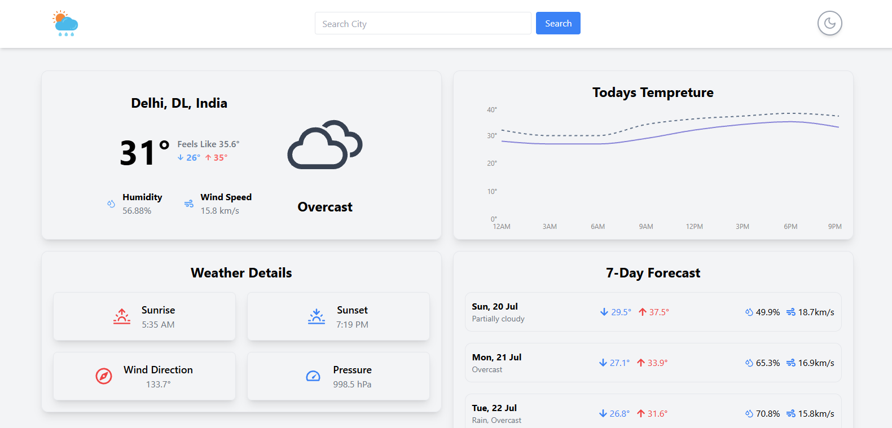

Here’s a clear and clean **README.md** for your **React + Tailwind Weather App** using Visual Crossing API:

---

# 🌤️ Weather App

A modern, responsive weather forecast app built with **React**, **TypeScript**, **Tailwind CSS**, and the **Visual Crossing Weather API**.
It shows current weather, hourly and 7-day forecasts with dynamic icons, dark/light theme toggle, and responsive UI for all screen sizes.

---

## 🚀 Features

* 🌎 **Search by City** — Get weather info for any location
* ☀️ **Current Weather** — Temperature, conditions, wind, humidity
* 🕒 **Hourly Forecast** — 24-hour temperature graph using Recharts
* 📅 **7-Day Forecast** — Clean daily summaries with icons
* 🌘 **Dark / Light Mode** — Toggle theme using context
* 📱 **Fully Responsive** — Works great on mobile & desktop

---

## 🛠️ Tech Stack

* **React + TypeScript**
* **Tailwind CSS** (utility-first styling)
* **Recharts** (hourly weather graphs)
* **Visual Crossing Weather API**
* **React Context API** (global state for weather & theme)
* **React Icons**

---

## 📦 Installation

```bash
git clone https://github.com/your-username/weather-app.git
cd weather-app
npm install
npm run dev
```

---

## 🔑 API Key Setup

1. Go to [Visual Crossing](https://www.visualcrossing.com/)
2. Create a free account and get your **API key**
3. Create a `.env` file in the root of your project:

```env
VITE_WEATHER_API_KEY=your_api_key_here
```

---

---

## 📸 Preview



---

---
## 🔗 Live Demo

👉 [View Live Site](https://weather-api-website-one.vercel.app//)

---

## 📁 Folder Structure

```
src/
│
├── components/        # UI components (Navbar, Forecasts, etc.)
├── context/           # Weather context provider
├── assets/            # Icons & images
├── hooks/             # Custom React hooks
├── App.tsx            # Main app layout
├── main.tsx           # Entry point
└── index.css          # Tailwind imports
```

---
